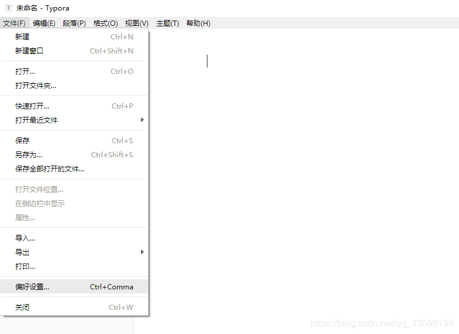
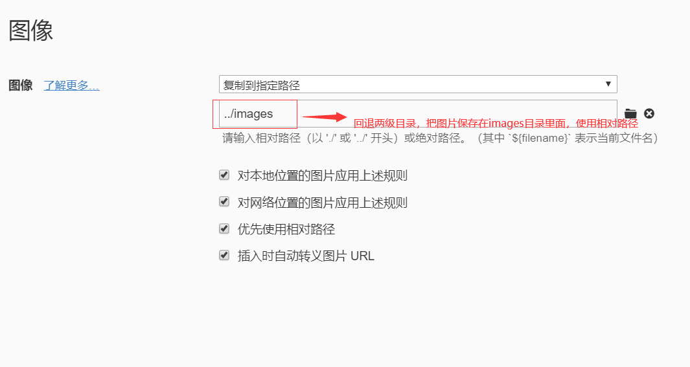
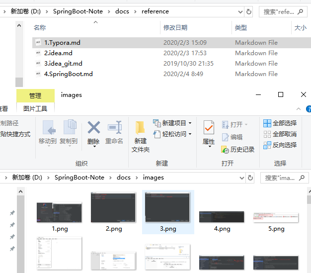

# Typora的使用

## 一、Typora基础信息

typora是一款极佳的markdown写作软件，编辑和预览两者合二为一，免费良心软件，推荐使用。

官网：https://www.typora.io/

typora版本：windows 版0.9.83

注意：低版本可能会出现图片问题

##二、Typora设置图片存储路径

用Typora编写文档,每次剪切的图都是默认保存在C盘中Typora默认的保存图片的文件夹中，当你清理电脑时，可能会造成图片的丢失，而且找起来编辑不是很方便,最好设置下剪切图片保存的位置。

点击 文件==>偏好设置==>设置图片插入模式

具体设置如下：

1. 点击文件,选择偏好设置

2. 原来是无特殊操作,个人还是倾向于选择图中选项

   选择此选项后会,在md文档所在文件夹中创建一个该文明名.assets的文件夹,并将剪切的图片保存到其中

3. 最终粘贴图片后结果

   

## 三、常用快捷键

- 无序列表：输入-之后输入空格
- 有序列表：输入数字+“.”之后输入空格
- 任务列表：-[空格]空格 文字
- 标题：ctrl+数字
- 表格：ctrl+t
- 生成目录：按回车
- 选中一整行：ctrl+l
- 选中单词：ctrl+d
- 选中相同格式的文字：ctrl+e
- 跳转到文章开头：ctrl+home
- 跳转到文章结尾：ctrl+end
- 搜索：ctrl+f
- 替换：ctrl+h
- 引用：输入>之后输入空格
- 代码块：ctrl+shift+k
- 加粗：ctrl+b
- 倾斜：ctrl+i
- 下划线：ctrl+u
- 删除线：alt+shift+5
- 插入图片：直接拖动到指定位置即可或者ctrl+shift+i
- 插入链接：ctrl+k