#IntelliJ IDEA  的安装、配置与使用

##一、IntelliJ IDEA 介绍	-- Eclipse	IBM

### 1. JetBrains 公司介绍

IDEA是 JetBrains 公司的产品，公司旗下还有其
它产品，比如：

WebStorm：用于开发 JavaScript、HTML5、CSS3 等前端技术；
PyCharm：用于开发 python
PhpStorm：用于开发 PHP
RubyMine：用于开发 Ruby/Rails
AppCode：用于开发 Objective - C/Swift
CLion：用于开发 C/C++
DataGrip：用于开发数据库和 SQL
Rider：用于开发.NET
GoLand：用于开发 Go
Android Studio：用于开发 android(google 基于 IDEA 社区版进行迭代)

###2. IntelliJ IDEA 介绍

IDEA，全称 IntelliJ IDEA，是 Java 语言的集成开发环境，IDEA 在业界被公认为是
最好的 java 开发工具之一，尤其在智能代码助手、代码自动提示、重构、J2EE
支持、Ant、JUnit、CVS 整合、代码审查、创新的 GUI 设计等方面的功能可以说
是超常的。

IntelliJ IDEA  在 2015 年的官网上这样介绍自己：
Excel at enterprise, mobile and web development with Java, Scala and Groovy,
with  all  the  latest  modern  technologies  and  frameworks  available  out  of  the
box.

简明翻译：IntelliJ IDEA  主要用于支持  Java、Scala、Groovy  等语言的开发工
具，同时具备支持目前主流的技术和框架，擅长于企业应用、移动应用和  Web  应
用的开发。

###3.IDEA 的主要优势

1. 强大的整合能力。比如：Git、Maven、Spring 等
2. 提示功能的快速、便捷
3. 好用的快捷键和代码模板 （写HelloWorld最快）
4. 精准搜索

### 4.IDEA 的下载地址：(官网)

## 二、windows 下安装过程

### 1. 安装前的准备

### 1.1  硬件要求(Hardware requirements)

内存：2 GB RAM minimum, 4 GB RAM recommended
硬盘：1.5 GB hard disk space + at least 1 GB for caches
屏幕：1024x768 minimum screen resolution

个人建议配置：内存 8G 或以上，CPU 最好 i5 以上，最好安装块固态硬盘(SSD)，将 IDEA
安装在固态硬盘上，这样流畅度会加快很多。

### 1.2  软件要求(Software requirements)

操作系统：Microsoft Windows 10/8/7/Vista/2003/XP (32 or 64 bit)

软件环境：

JRE 1.8 is bundled with the IntelliJ IDEA distribution. You do not need to install Java
on your computer to run IntelliJ IDEA.
A standalone JDK is required for Java development.

注意：这里如果没有安装 JDK 1.8的话，需要安装jdk1.8.

###2.具体安装过程

双击：

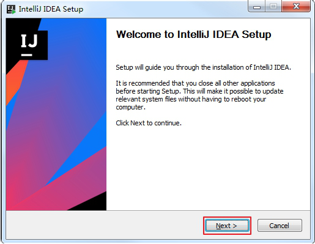

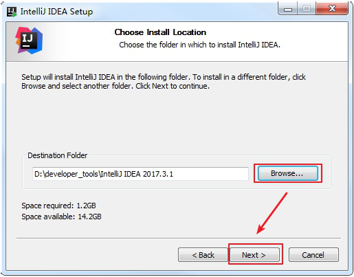

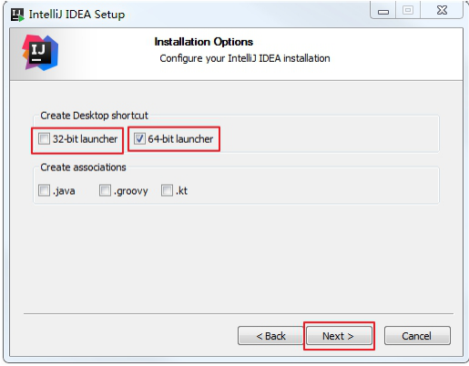

确认 32 位版还是 64 位版
确认是否与.java、.groovy、.kt 格式文件进行关联，这里也可以选择不关联。

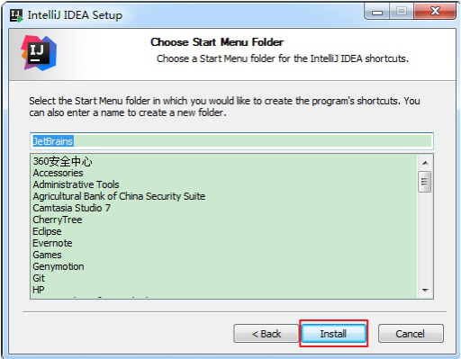

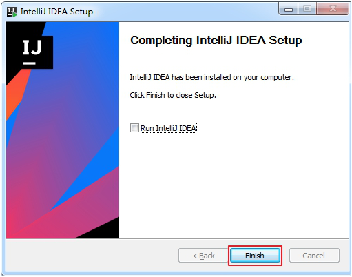

###3.安装总结

从安装上来看，IntelliJ IDEA  对硬件的要求似乎不是很高。可是实际在开发中其
实并不是这样的，因为  IntelliJ IDEA  执行时会有大量的缓存、索引文件，所以
如果你正在使用  Eclipse / MyEclipse，想通过  IntelliJ IDEA  来解决计算机的卡、
慢等问题，这基本上是不可能的，本质上你应该对自己的硬件设备进行升级。

###4.idea的破解（略）

## 三、idea的基本设置

###1.基本设置

1.设置界面风格及修改外部UI尺寸大小

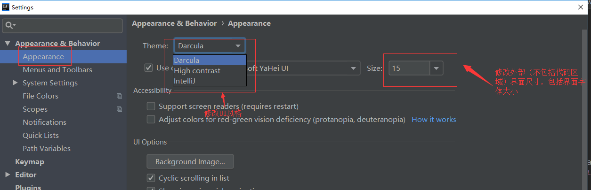

2.打开IDEA时设置不重新打开最近的项目

> IDEA默认会打开最近的项目，有时候我们需要自己选择要打开的项目，不勾选该选项可以实现。

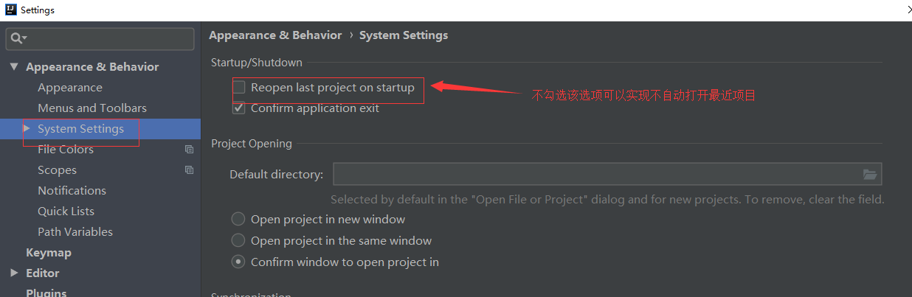

3.设置IDEA的快捷键

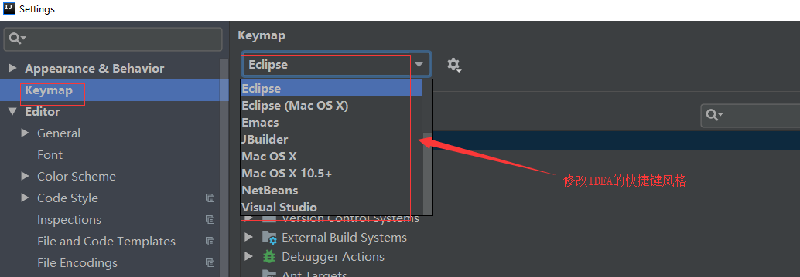

4.设置代码字体大小

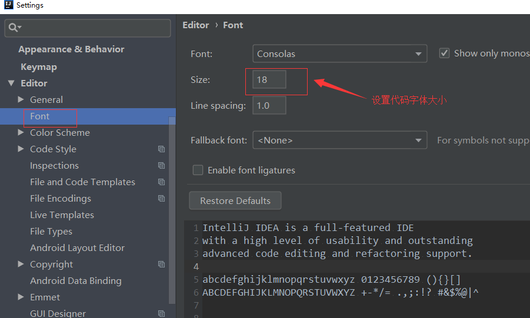

5.设置项目文件编码格式

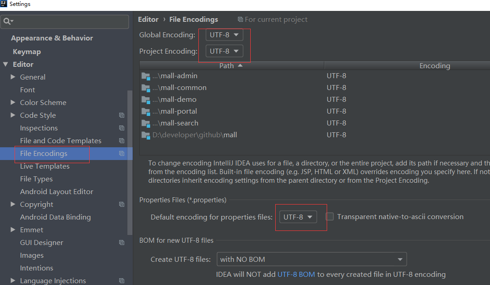

6.设置代码提示的匹配模式

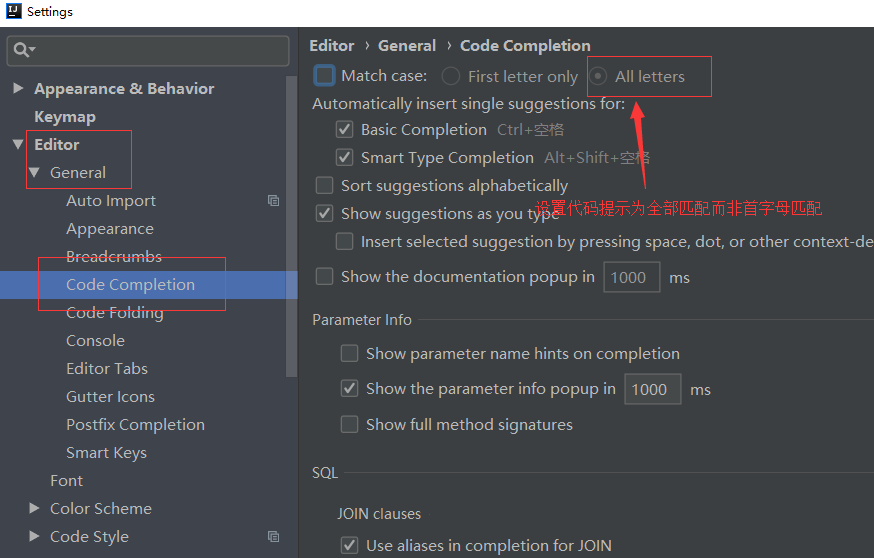

7.设置新建类文件的类注释模版

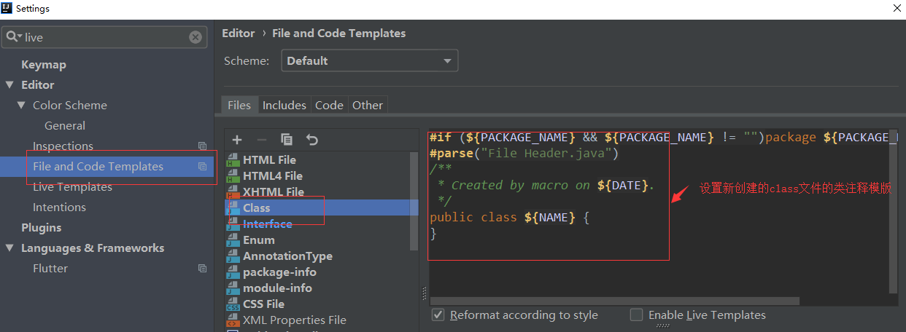

8.配置maven

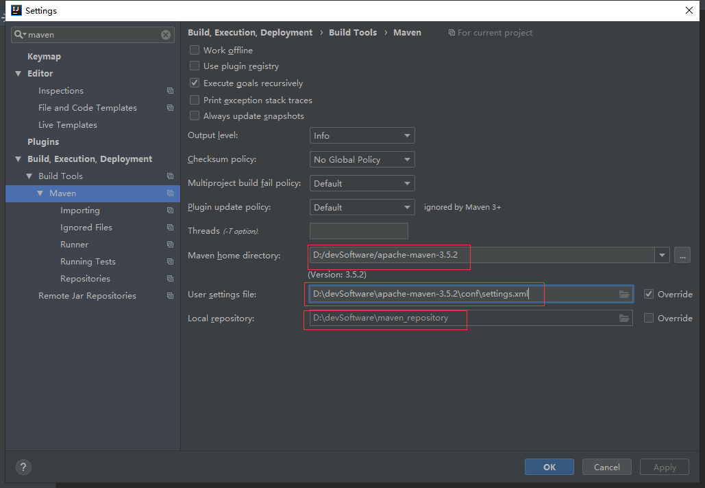

## 四、idea的插件安装

1.Free MyBatis plugin

> 非常好用的MyBatis插件，对MyBatis的xml具有强大的提示功能，同时可以关联mapper接口和mapper.xml中的sql实现。

可以从mapper接口和mapper.xml文件中相互跳转

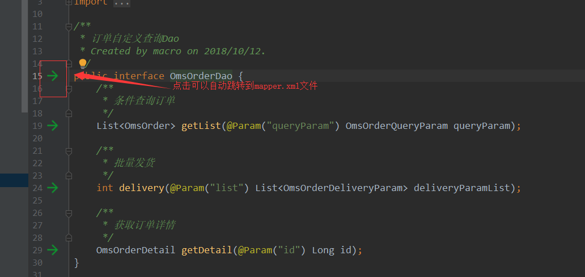

mapper.xml中的各种提示

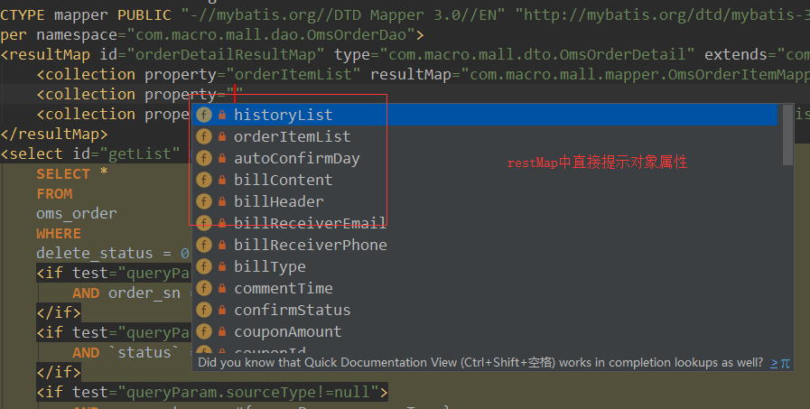
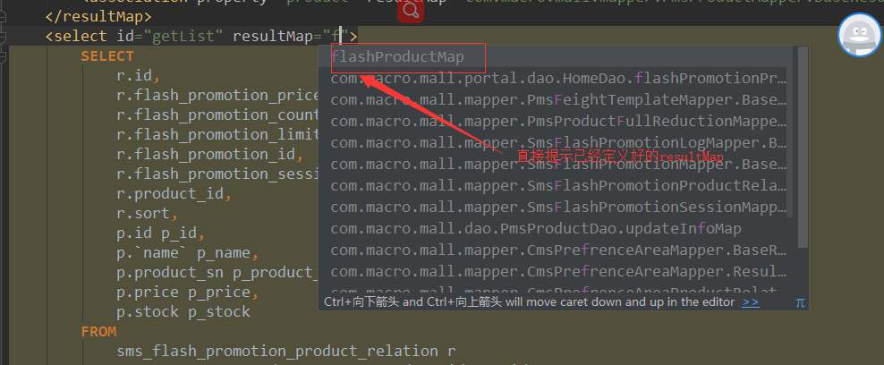

Lombok plugin

> Lombok为Java语言添加了非常有趣的附加功能，你可以不用再为实体类手写getter,setter等方法，通过一个注解即可拥有。

一个没有getter,setter方法的类通过添加@Getter和@Setter注解拥有了getter,setter方法。

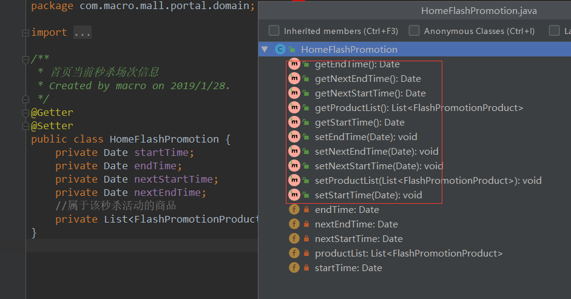

## 五、idea的快捷键

###1.IDEA和Eclipse常用快捷键对比

> 友情提示：IDEA可以设置为Eclipse风格的快捷键，在File->Settings->Keymap处，如需更改部分快捷键可按如下表格中的英文描述进行搜索，并改为相应快捷键。

| Eclipse       | IDEA                | 英文描述                      | 中文描述                            |
| ------------- | ------------------- | ----------------------------- | ----------------------------------- |
| ctrl+shift+r  | ctrl+shift+n        | Navigate->File                | 找工作空间的文件                    |
| ctrl+shift+t  | ctrl+n              | Navigate->Class               | 找类定义                            |
| ctrl+shift+g  | alt+f7              | Edit->Find->Find Usages       | 查找方法在哪里调用.变量在哪里被使用 |
| ctrl+t        | ctrl+t              | Other->Hierarchy Class        | 看类继承结构                        |
| ctrl+o        | ctrl+f12            | Navigate->File Structure      | 搜索一个类里面的方法                |
| shift+alt+z   | ctrl+alt+t          | Code->Surround With           | 生成常见的代码块                    |
| shift+alt+l   | ctrl+alt+v          | Refactor->Extract->Variable   | 抽取变量                            |
| shift+alt+m   | ctrl+alt+m          | Refactor->Extract->Method     | 抽取方法                            |
| alt+左箭头    | ctrl+alt+左箭头     | Navigate->Back                | 回退上一个操作位置                  |
| alt+右箭头    | ctrl+alt+右键头     | Navigate->Forward             | 前进上一个操作位置                  |
| ctrl+home     | ctrl+home           | Move Caret to Text Start      | 回到类最前面                        |
| ctrl+end      | ctrl+end            | Move Caret to Text End        | 回到类最后面                        |
| ctrl+e        | ctrl+e              | View->Recent Files            | 最近打开的文件                      |
| alt+/         | ctrl+space          | Code->Completion->Basic       | 提示变量生成                        |
| ctrl+1        | alt+enter           | Other->Show Intention Actions | 提示可能的操作                      |
| ctrl+h        | ctrl+shift+f        | Find in Path                  | 全局搜索                            |
| alt+上/下箭头 | alt+shift+上/下箭头 | Code->Move Line Up/Down       | 移动一行代码                        |
| ctrl+/        | ctrl+/              | Other->Fix doc comment        | 方法注释                            |
| ctrl+alt+s    | alt+insert          | Generate                      | 生成getter,setter,tostring等        |

###2.常用快捷键

1	执行(run)	alt+r
2	提示补全  (Class Name Completion)	alt+/
3	单行注释	ctrl + /
4	多行注释	ctrl + shift + /
5	向下复制一行  (Duplicate Lines)	ctrl+alt+down
6	删除一行或选中行  (delete line)	ctrl+d
7	向下移动行(move statement down)	alt+down
8	向上移动行(move statement up)	alt+up
9	向下开始新的一行(start new line)	shift+enter
10	向上开始新的一行  (Start New Line before current)	ctrl+shift+enter
11	如何查看源码  (class)	ctrl  +  选 中指 定的 结构  或 ctrl + shift + t
12	万能解错/生成返回值变量	alt + enter
13	退回到前一个编辑的页面  (back)	alt + left
14	进入到下一个编辑的页面(针对于上条) (forward)	alt + right
15	查看继承关系(type hierarchy)	F4
16	格式化代码(reformat code)	ctrl+shift+F
17	提示方法参数类型(Parameter Info)	ctrl+alt+/
18	复制代码	ctrl + c
19	撤销	ctrl + z
20	反撤销	ctrl + y
21	剪切	ctrl + x
22	粘贴	ctrl + v
23	保存	ctrl + s
24	全选	ctrl + a
25	选中数行，整体往后移动	tab
26	选中数行，整体往前移动	shift + tab
27	查看类的结构：类似于 eclipse 的 outline	ctrl+o
28	重构：修改变量名与方法名(rename)	alt+shift+r
29	大写转小写/小写转大写(toggle case)	ctrl+shift+y

## 六、idea的maven项目的入门HelloWorld

###1、重要说明

1. 在 Eclipse 中我们有 Workspace（工作空间）和 Project（工程）的概念，在 IDEA

   中只有 Project（工程）和 Module（模块）的概念。这里的对应关系为：

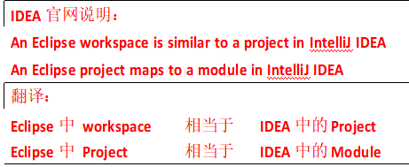

2. 从 Eclipse 转过来的人总是下意识地要在同一个窗口管理 n 个项目，这在

   IntelliJ IDEA 是无法做到的。IntelliJ IDEA 提供的解决方案是打开多个项目实例，

   即打开多个项目窗口。即：一个 Project 打开一个 Window 窗口。

3. 在 IntelliJ IDEA 中 Project 是最顶级的级别，次级别是 Module。一个 Project可以有多个 Module。目前主流的大型项目都是分布式部署的，结构都是类似这种多 Module 结构。

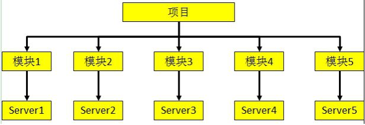

### 2.具体步骤

1、如果刚安装完IDEA，打开之后出现以下界面，点击Create New Project

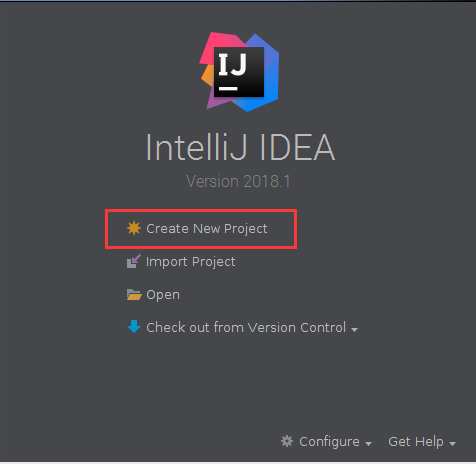

2、出现New Project对话框，在左侧选择Maven，然后直接点击Next（如果想快速创建，可以勾线Create from archetype，然后选择一个模板即可。在此我们不勾选）。

3、接着填写GroupID、ArtifactId，点击Next

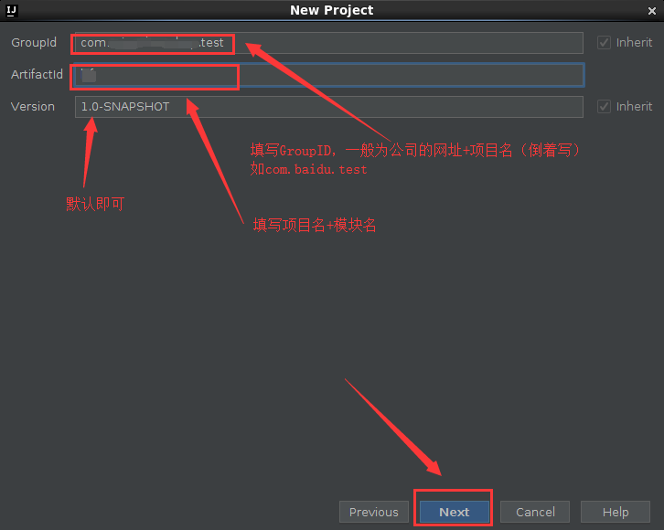

4、接着点击Next即可

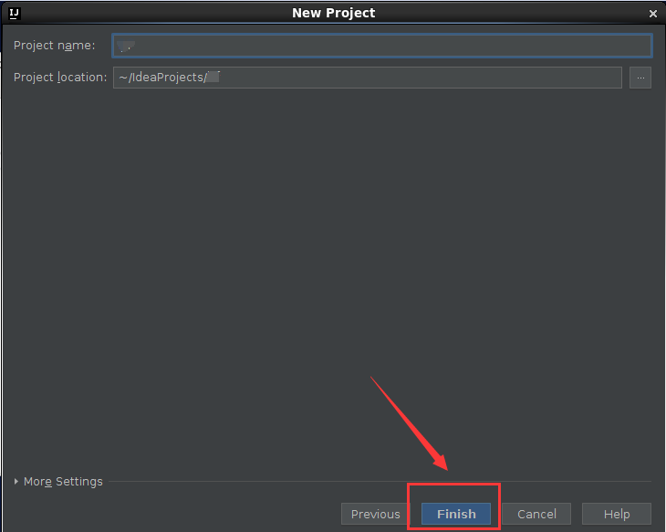

5、之后会出现如下界面，界面信息为 .xml配置文件信息

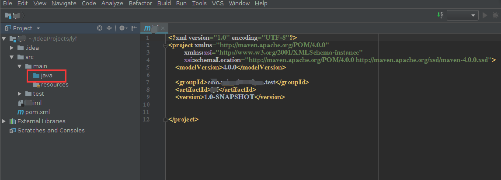

在右下角选择Enable Auto-Import，这样在修改配置文件时自动导入了

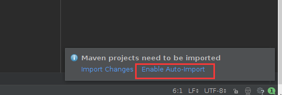

6、在java文件下可以创建自己的包名，也可直接创建class文件

右键java文件夹，New->java Class，填写类名，如HelloWorld

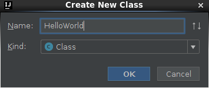

7、在类中编写相关代码

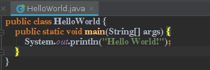

8、运行程序

在运行之前需要先进行相关的配置。点击Run->Edit Configurations...

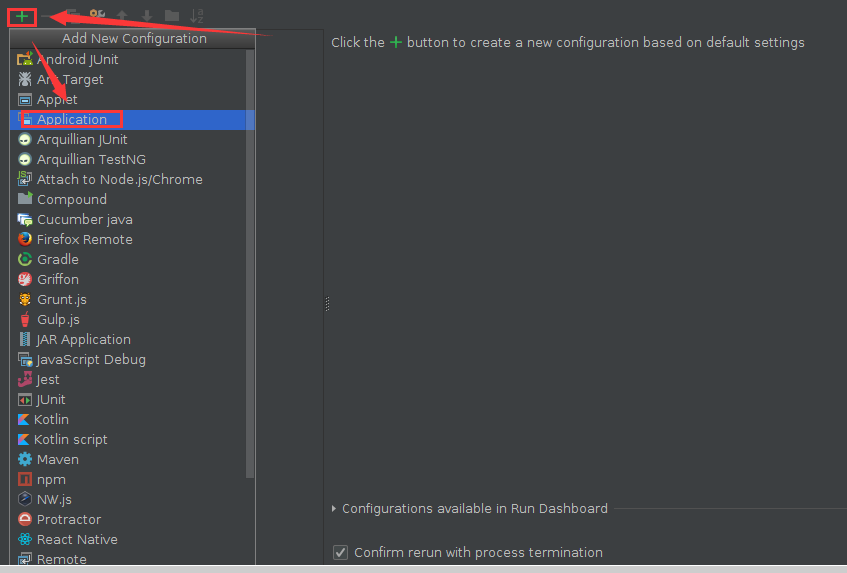

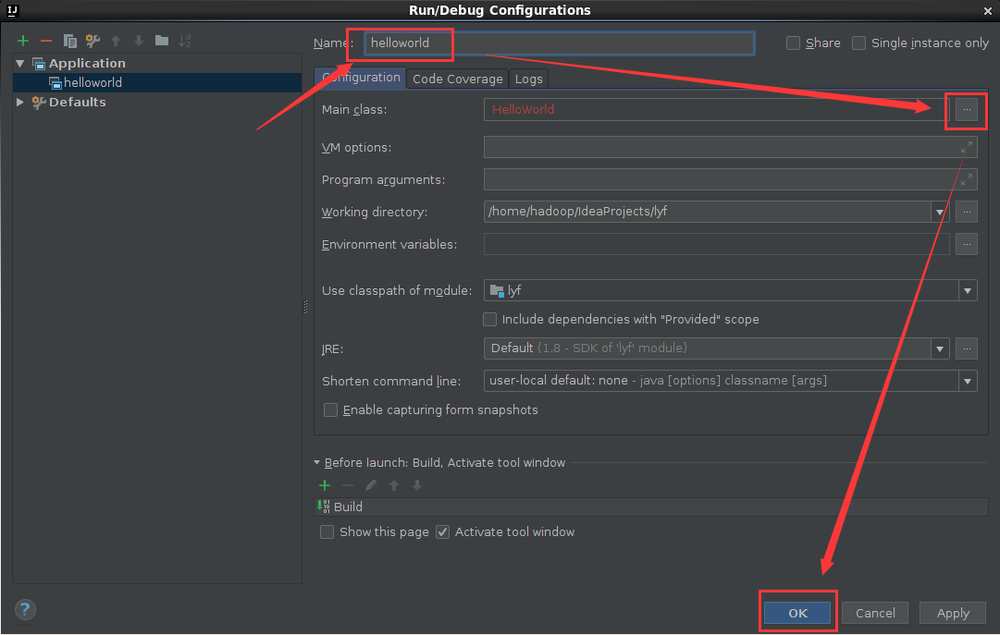

然后点击Run->Run 'helloworld'

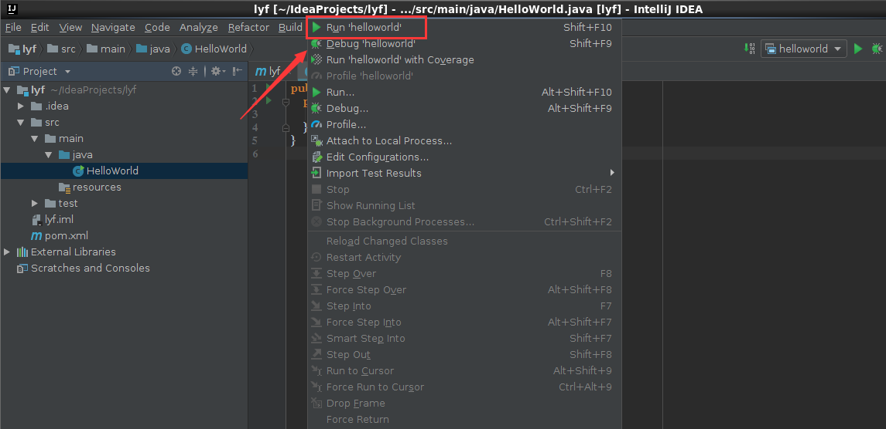

运行结果如下

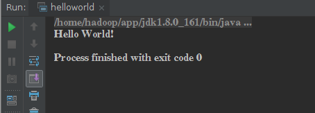