# idea的git操作，看着一篇就够啦！

## 1、基本配置

> 大家在使用Git时，都会选择一种Git客户端，在IDEA中内置了这种客户端，可以让你不需要使用Git命令就可以方便地进行操作，本文将讲述IDEA中的一些常用Git操作。

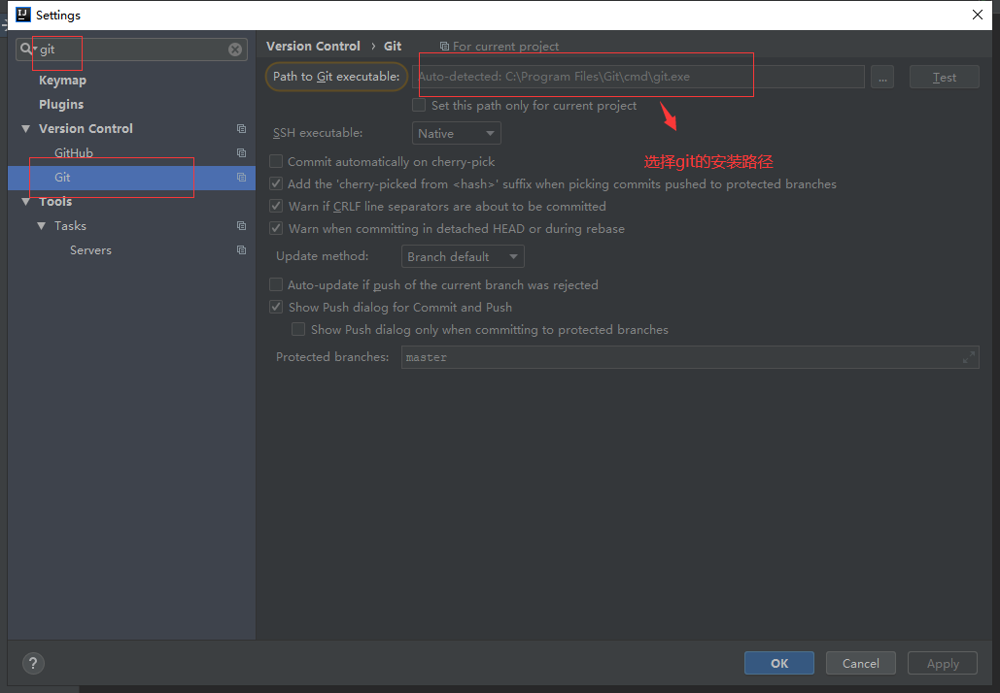

## 2、操作流程

### 2.1在Gitlab中创建一个开源项目仓库

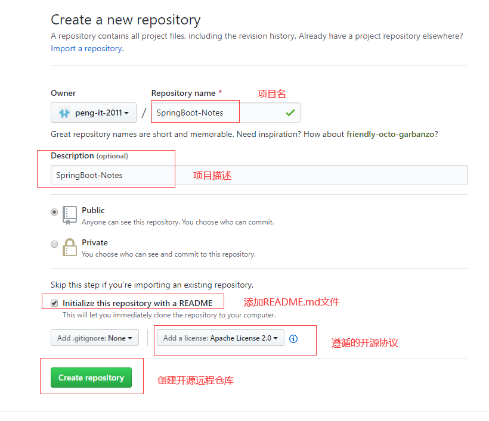

###2.2 clone项目到本地

- 打开idea从Git检出项目的界面： 

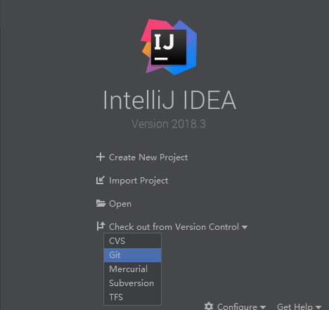

- 输入Git地址进行检出：

  复制项目地址

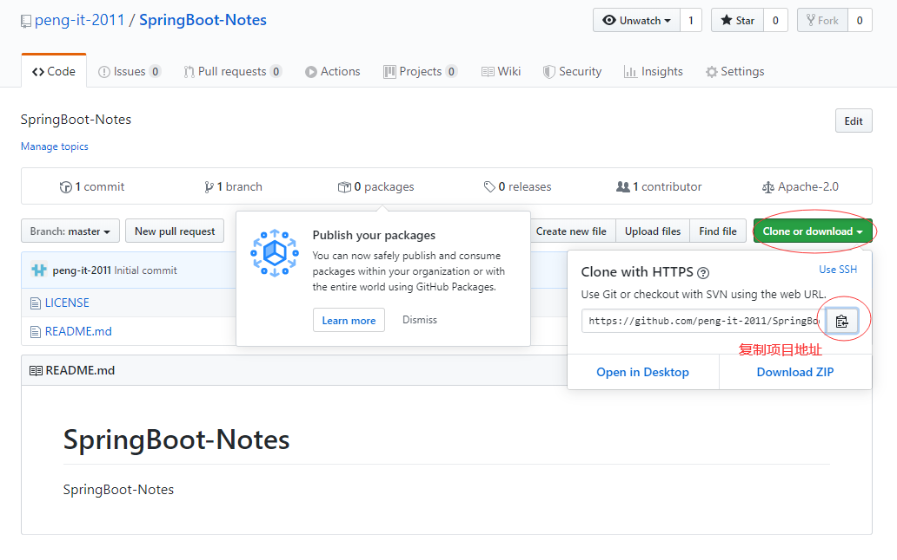

粘贴项目地址

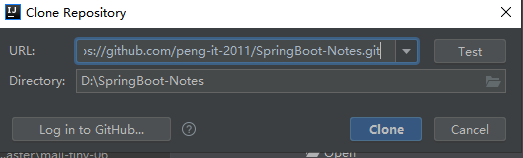

- 暂时不生成IDEA项目，因为项目还没初始化：

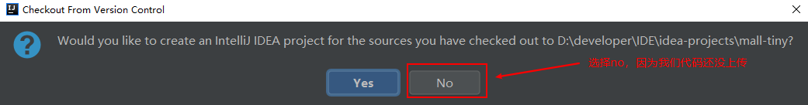

### 2.3初始化项目并提交代码

- 将idea-HelloWorld的代码复制到该目录中：

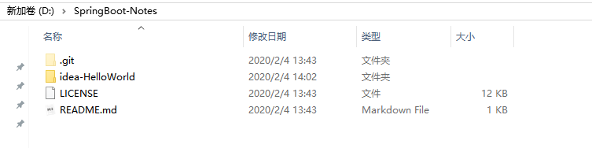

- 这里我们需要一个.gitignore文件来防止一些IDEA自动生成的代码被提交到Git仓库去：

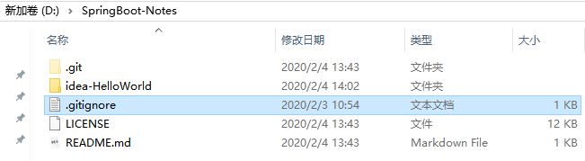

- 使用IDEA打开项目：

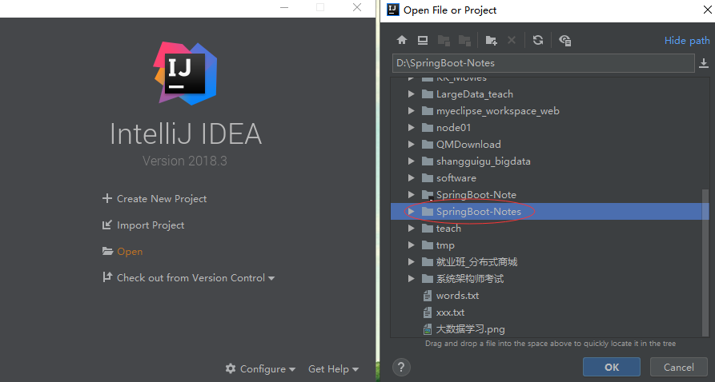

- 右键项目打开菜单，将所有文件添加到暂存区中：

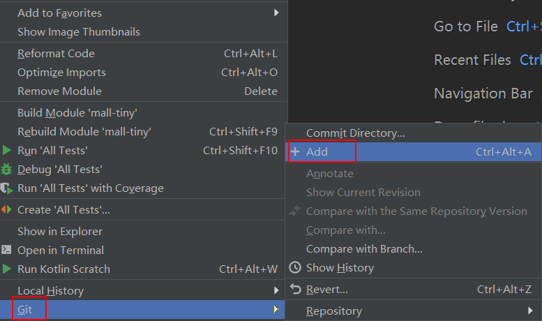

- 添加注释并提交代码：

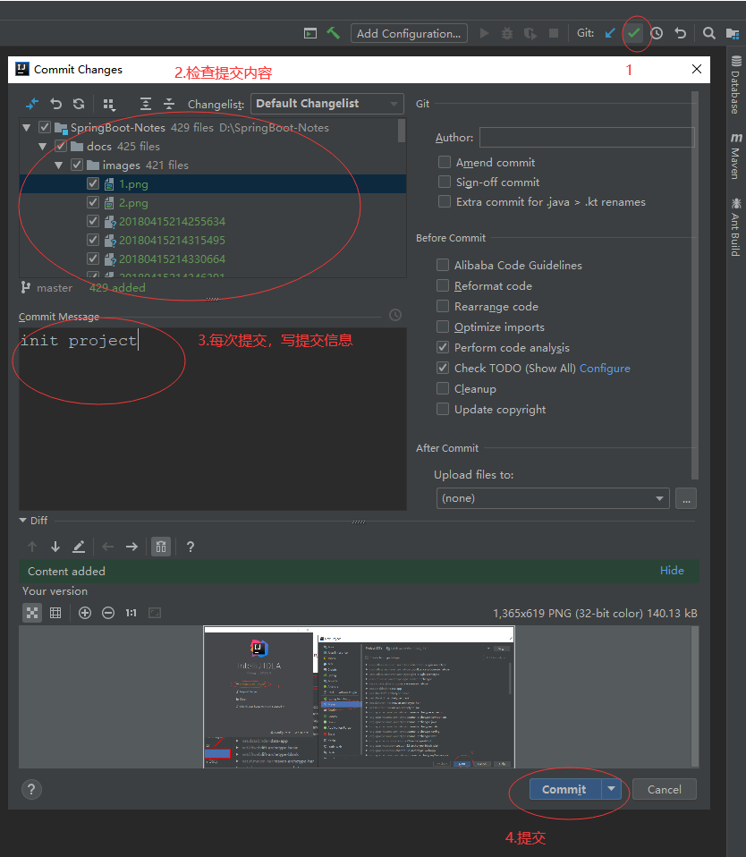

### 2.4将代码推送到远程仓库

- 点击push按钮推送代码：

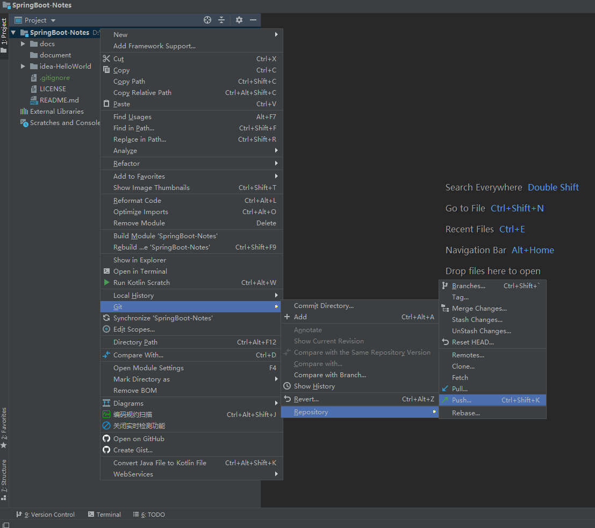

- 确认推送内容：

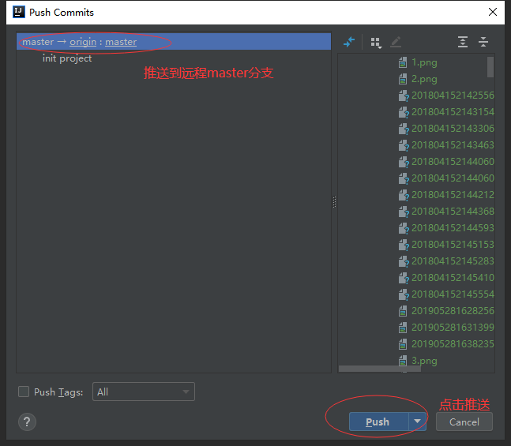

- 查看远程仓库发现已经提交完成：

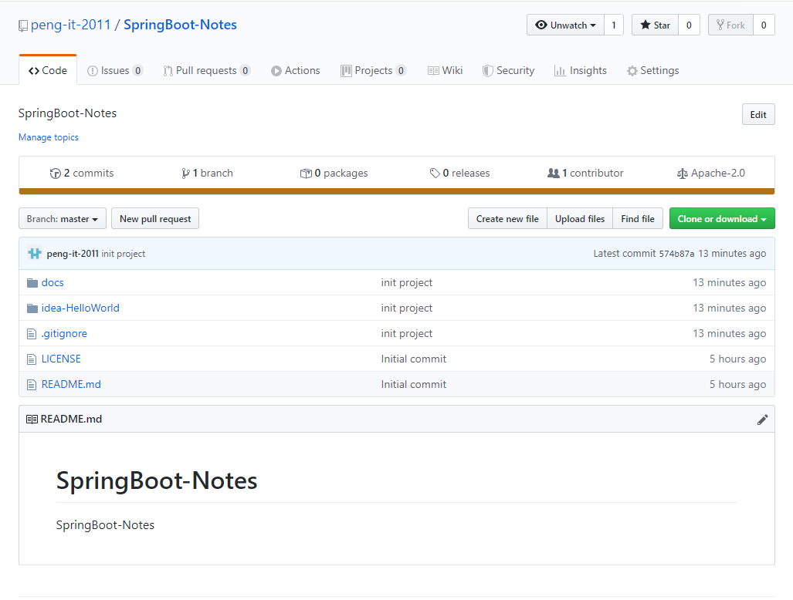

###2.5 从远程仓库拉取代码

- 在远程仓库添加一个README-TEST.md文件：
- 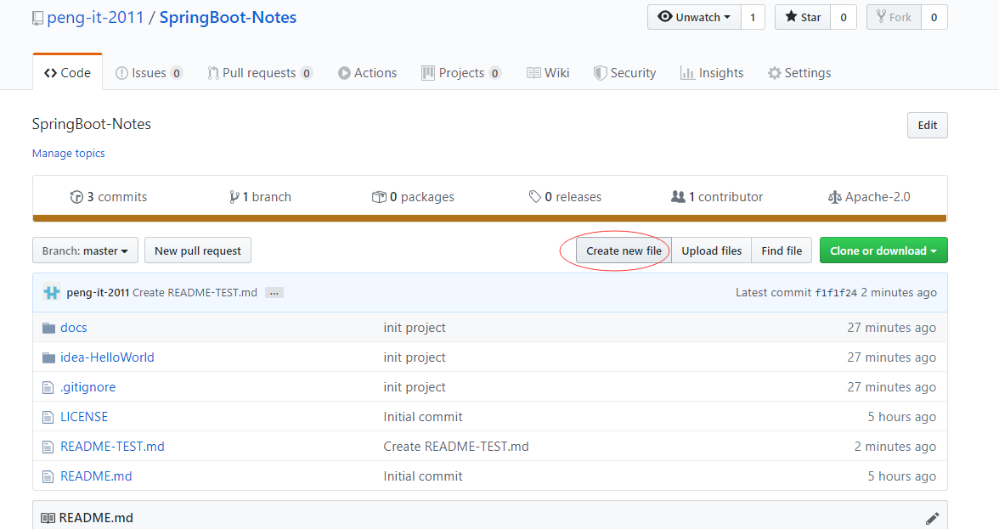

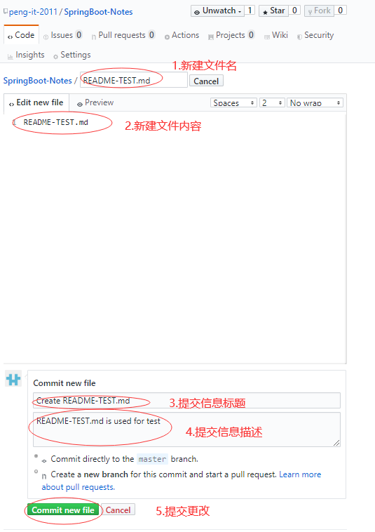

- 从远程仓库拉取代码：

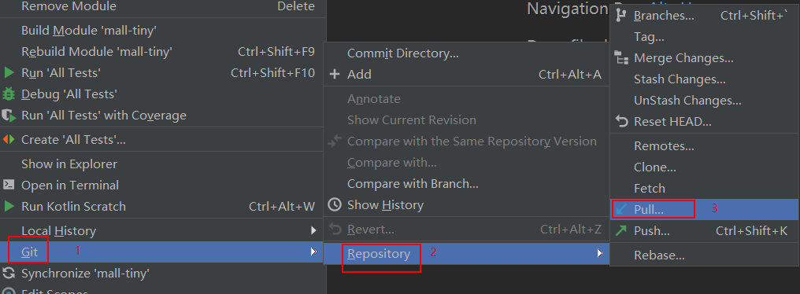

- 确认拉取分支信息：

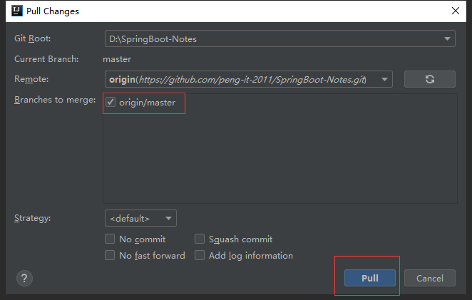

- 把远程仓库的项目代码更改拉取到本地项目

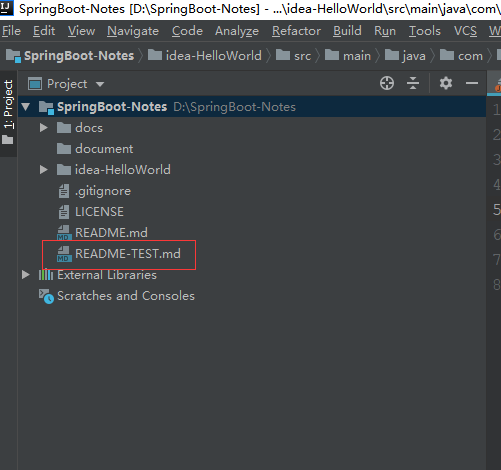