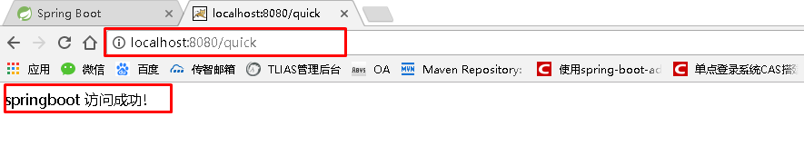

# SpringBoot基础

## 学习目标：

1. 能够理解Spring的优缺点
2. 能够理解SpringBoot的特点
3. 能够理解SpringBoot的核心功能
4. 能够搭建SpringBoot的环境

## 一、SpringBoot简介

### 1.1 Spring的优缺点分析

+ 回顾一下Spring框架？

  + mybatis、hibernate、strust2....

  + 为什么会有Spring框架？

    + 原因：javaee体系架构的笨重、臃肿，导致有spring框架而生

      EJB的企业级的组件（重量级的企业BEAN）

      简单理解：可以实现远程调用类组件

      写一个helloworld程序，需要8个类文件采用实现

    - 解决：interface21公司写一个Spring框架

      最大的特点：轻量级解决java应用问题

      主要体现：解耦（解决开发严重依赖性）

      Spring框架核心：

      - OC容器（控制反转）

      - AOP（面向切面编程）

  + 总结：Spring是Java企业版（Java Enterprise Edition，JEE，也称J2EE）的轻量级代替品。无需开发重量级的Enterprise JavaBean（EJB），Spring为企业级Java开发提供了一种相对简单的方法，通过依赖注入和面向切面编程，用简单的Java对象（Plain Old Java Object，POJO）实现了EJB的功能。

  + Spring框架产生一系列问题？

    - Spring框架与第三的架构组件整合，需要大量编写相应的配置

      文件信息（xml）

    - 整合SSM架构(Spring+mybatis+springMVC)

      + 1、配置web.xml文件（DispatchServlet）

      + 2、在类路径：spring-mvc.xml文件

        a、扫描组件

        b、配置各种的处理器（处理器映射器、处理器适配

        ​	器）

        c、视图解释器

    - 3、spring-service.xml

      - 配置数据源

      - 配置事务管理

    - 4、spring-dao.xml
      - 配置mybatis的信息

    - spring整合工作流引擎(jbpm)
      - 要编写一个xml配置

    - 需求解决Spring框架带的问题：
      - 由此产生的springboot框架

  + 总结：

    1. 虽然Spring的组件代码是轻量级的，但它的配置却是重量级的。一开始，Spring用XML配置，而且是很多XML配置。Spring 2.5引入了基于注解的组件扫描，这消除了大量针对应用程序自身组件的显式XML配置。Spring 3.0引入了基于Java的配置，这是一种类型安全的可重构配置方式，可以代替XML。
    2. 所有这些配置都代表了开发时的损耗。因为在思考Spring特性配置和解决业务问题之间需要进行思维切换，所以编写配置挤占了编写应用程序逻辑的时间。和所有框架一样，Spring实用，但与此同时它要求的回报也不少。
    3. 除此之外，项目的依赖管理也是一件耗时耗力的事情。在环境搭建时，需要分析要导入哪些库的坐标，而且还需要分析导入与之有依赖关系的其他库的坐标，一旦选错了依赖的版本，随之而来的不兼容问题就会严重阻碍项目的开发进度。

###1.2 SpringBoot的概述

- 什么是SpringBoot框架

  - 从官网([](https://spring.io/projects/spring-boot#overview))

    - Spring Boot makes it easy to create stand-alone,

      production-grade Spring based Applications that you can

      "just run".

      - Springboot非常简单、容易就可以创建基于spring的产品

        级应用，并且能够独立运行的框架

  - SpringBoot的特征？

    1. 快速创建独立运行的spring应用

    2. 内嵌了运行应用的容器(tomcat)(不需要打成war包形式提供运

       行，它是一个独立的jar应用)

    3. 自身提供大量的“ starter ”依赖，便于整合其它组件

       - 支持redis，配置redis所对应的starter

       - 支持dubbo，配置dubbo所对应的starter

       - 支持springmvc，配置web的starter

         ......

    4. 它提供一种自配置能力（AutoConfiguration），可以简化应

       用开发

    5. 基于产品级的框架，提供应用指标：应用健康系数

    6. 不需要编写大量的配置文件（xml）

## 二、SpringBoot快速入门

###2.1 代码实现

### 2.1.1 创建Maven工程

使用idea工具创建一个maven工程，该工程为普通的java工程即可


### 2.1.2 添加SpringBoot的起步依赖

SpringBoot要求，项目要继承SpringBoot的起步依赖spring-boot-starter-parent

```xml
<parent>
    <groupId>org.springframework.boot</groupId>
    <artifactId>spring-boot-starter-parent</artifactId>
    <version>2.0.1.RELEASE</version>
</parent>
```

SpringBoot要集成SpringMVC进行Controller的开发，所以项目要导入web的启动依赖

```xml
<dependencies>
    <dependency>
        <groupId>org.springframework.boot</groupId>
        <artifactId>spring-boot-starter-web</artifactId>
    </dependency>
</dependencies>
```


### 2.1.3 编写SpringBoot引导类

要通过SpringBoot提供的引导类起步SpringBoot才可以进行访问

```java
package com.yueqian;

import org.springframework.boot.SpringApplication;
import org.springframework.boot.autoconfigure.SpringBootApplication;

@SpringBootApplication
public class MySpringBootApplication {

    public static void main(String[] args) {
        SpringApplication.run(MySpringBootApplication.class);
    }

}
```

### 2.1.4 编写Controller

在引导类MySpringBootApplication同级包或者子级包中创建QuickStartController

```java
package com.yueqian.controller;

import org.springframework.stereotype.Controller;
import org.springframework.web.bind.annotation.RequestMapping;
import org.springframework.web.bind.annotation.ResponseBody;

@Controller
public class QuickStartController {
    
    @RequestMapping("/quick")
    @ResponseBody
    public String quick(){
        return "springboot 访问成功!";
    }
    
}
```

### 2.1.5 测试

执行SpringBoot起步类的主方法，控制台打印日志如下：

```
.   ____          _            __ _ _
 /\\ / ___'_ __ _ _(_)_ __  __ _ \ \ \ \
( ( )\___ | '_ | '_| | '_ \/ _` | \ \ \ \
 \\/  ___)| |_)| | | | | || (_| |  ) ) ) )
  '  |____| .__|_| |_|_| |_\__, | / / / /
 =========|_|==============|___/=/_/_/_/
 :: Spring Boot ::        (v2.0.1.RELEASE)

2018-05-08 14:29:59.714  INFO 5672 --- [           main] com.yueqian.MySpringBootApplication      : Starting MySpringBootApplication on DESKTOP-RRUNFUH with PID 5672 (C:\Users\muzimoo\IdeaProjects\IdeaTest\springboot_quick\target\classes started by muzimoo in C:\Users\muzimoo\IdeaProjects\IdeaTest)
... ... ...
o.s.w.s.handler.SimpleUrlHandlerMapping  : Mapped URL path [/**] onto handler of type [class org.springframework.web.servlet.resource.ResourceHttpRequestHandler]
2018-05-08 14:30:03.126  INFO 5672 --- [           main] o.s.j.e.a.AnnotationMBeanExporter        : Registering beans for JMX exposure on startup
2018-05-08 14:30:03.196  INFO 5672 --- [           main] o.s.b.w.embedded.tomcat.TomcatWebServer  : Tomcat started on port(s): 8080 (http) with context path ''
2018-05-08 14:30:03.206  INFO 5672 --- [           main] com.yueqian.MySpringBootApplication      : Started MySpringBootApplication in 4.252 seconds (JVM running for 5.583)
```

通过日志发现，Tomcat started on port(s): 8080 (http) with context path ''

tomcat已经起步，端口监听8080，web应用的虚拟工程名称为空

打开浏览器访问url地址为：http://localhost:8080/quick



